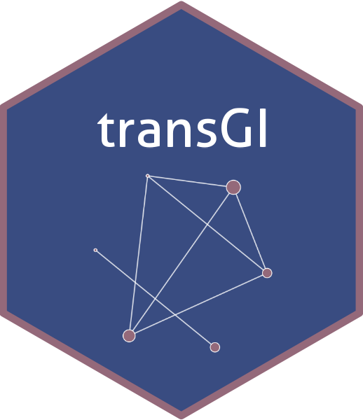

```{r, include=FALSE}
knitr::knit_hooks$set(pngquant = knitr::hook_pngquant)

knitr::opts_chunk$set(
  echo = T,
  message = FALSE, 
  fig.path = "man/figures/README-",
  collapse = TRUE,
  comment = "",
  dev = "ragg_png",
  dpi = 72,
  fig.retina = 2,
  fig.width = 10.6667,
  fig.height = 3.3334,
  fig.align = "center",
  out.width = "100%",
  pngquant = "--speed=1 --quality=50"
)
```

# transGI: Nonparametric transformation method of transcriptome based on prior gene interactions 

The interaction between genes can be represented as a scale-free directed network. A common practice is to infer the strength of signals for genes and their downstream functions based on gene expression levels. Although this approach is simple, it does not consider prior information on gene-gene interactions. 

To incorporate prior information on gene interactions into the model, a non-parametric transformation of transcript expression is a worthwhile consideration. transGI has compiled several methods and pairs of gene interactions from previously published literature, allowing users to quantitatively construct gene interaction networks de novo.

Nonparametric transformation method of transcriptome based on prior gene interactions has the following potential advantages: 

1. It allows users to construct a gene interaction network for single samples, by comparing it with a reference network or selecting high-variance features from it, quantifying the perturbation effects of gene expression in specific tissues or central networks that promote biological events; 
2. Non-parametric transformation methods have good cross-dataset performance and can robustly remove batch effects between data sets. For microarrays and RNA-seq, due to differences in platforms, technologies, quantification methods, and sensitivities between the two, the effectiveness of nonparametric transformation methods is comparable to traditional methods such as quantile regression; 
3. Nonparametric transformation methods rely on fewer assumptions.

Currently, the functions supported by transGI include:

1. Using transformation methods from previously publication like deltarank or pairwise calculation methods to construct single-sample networks on prior gene interaction pairs.
2. Providing a gene enrichment method that uses prior gene interaction pairs as background gene sets. Simply put, it is a weighted gene enrichment method that uses the node degree of each prior gene interaction pair as weight.
3. Providing a series of methods for selecting features with high variance or correlation with certain indicators, as well as visualizing gene interaction networks.

## Installation

You can install the development version of transGI from [GitHub](https://github.com/) with:

``` r
# install.packages("devtools")
devtools::install_github("Vinnish-A/transGI")
```

## Example

Use the `transGI` function to transform transcriptome data.

```{r}
library(transGI)

testMat = system.file('extdata', 'inputMatTest.csv', package = 'transGI') |>
  read.csv(row.names = 'symbol') |>
  as.matrix() |> 
  _[1:2000, ]
res = transGI(testMat, 'deltarank', 'reactome', nThreads_ = 4)
```

Use `enrichGraph` to calculate the enrichment results of genes in the background gene interaction network.

```{r}
symbols = readLines('material/symbols.csv')

db = read_gmt('material/h.all.v2023.2.Hs.symbols.gmt')
res_enrich = enrichGraph(symbols, db_ = db, pathways_ = 'all', bgNet_ = 'reactome')

autoBar(res_enrich)
```

## Future Plan

Currently, transGI has implemented a series of functions including feature engineering, feature selection, gene enrichment, and simple visualization. In the future, we plan to add the following features to transGI:

1. Infer new potential gene pairs for interaction based on perturbation effects in experimental and control groups
2. For networks of interactions between two or more genes, add functions such as network comparison and key node selection
3. Add more methods for constructing single-sample interaction networks and calculating perturbation effects.

## Citation

The calculation method for deltarank is obtained from [@10.1093/bib/bbaa268], and the pairwise calculation method is obtained from [@10.1093/bib/bbac344]

If you use transGI in your research, please cite:

```{r echo=FALSE}
citation_of = function(...) {
  
  pkgs_ = unlist(list(...))
  
  each_of_ = function(pkg_) {
    c(capture.output(utils:::print.bibentry(citation(pkg_), style = "Bibtex")), "")
  }
  
  unlist(lapply(pkgs_, each_of_))
  
}

citation_of('transGI') |> 
    cat(sep = '\n')
```

## reference
